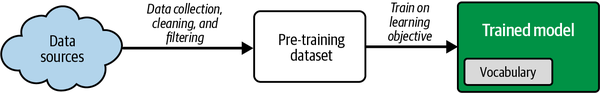
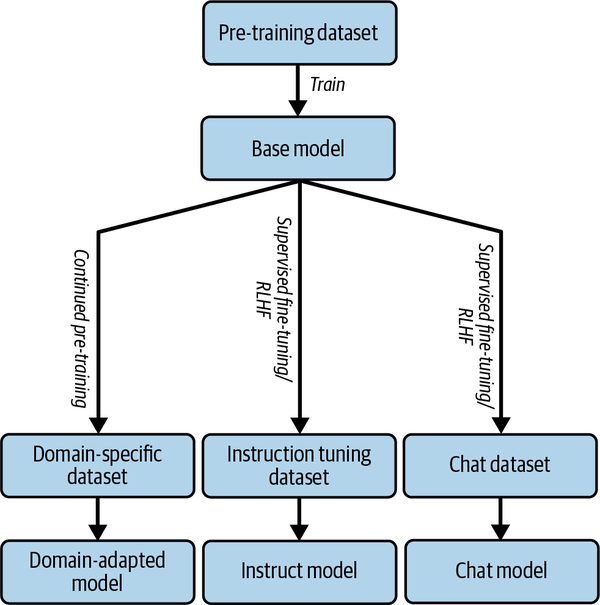
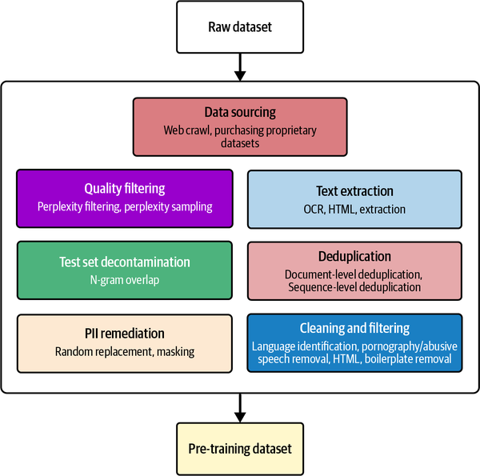

## Ingredients of an LLM

- Pre-training data

Lately, model providers have been augmenting the base model by fine-tuning it on much smaller datasets to steer them toward being more aligned with human needs and preferences.

Some popular tuning modes are:

- Supervised instruction fine-tuning (SFT), so that the model is better at following human instructions
    
- Reinforcement learning by human feedback (RLHF), so that the model is better aligned with human preferences
    
- Domain-adaptive or task-adaptive continued pre-training, so that the model is better attuned to specific domains and tasks
    
    
    
- It is infeasible to create such a large supervised dataset with human annotations, hence the predominant means to pre-train language models is using *self-supervised* learning, where the target labels exist within your training inputs.
    
- **Note: CommonCrawl/C4, The Pile, WebText/OpenWebText/OpenWebText2, FineWeb are some examples of opensource datasets available for training models**
    
- # Synthetic Pre-Training Data
    
    An emerging trend is the use of LLMs to generate synthetic data that can be used for pre-training LLMs. One of the first success stories in training LLMs on datasets with a significant proportion of synthetic data is Microsoft’s [phi series of models](https://oreil.ly/eFphR). For the phi-1.5 model, Microsoft created 20 billion tokens of synthetic data, using 20,000 seed topics and samples from real-world web datasets in their prompts.
    
    Hugging Face released [Cosmopedia](https://oreil.ly/Pdwnw), an open source synthetic dataset used to train the SmolLM series of models. Its seed data included curated sources like Stanford courses, Khan Academy, and WikiHow, as well as general web data.
    
- # Training Data Preprocessing
    
    Once we have collected or procured data, we need to filter and clean the data by running it through a preprocessing pipeline. Data preprocessing is the most unglamorous and underappreciated part of the LLM training pipeline, yet perhaps the most important.
    
    
    
- **Data Collection:** Gather diverse text sources.
    
- **Cleaning:** Remove noise, low-quality content, and toxic data.
    
- **Normalization:** Standardize text format.
    
- **Tokenization:** Break text into subword tokens.
    
- **Data Augmentation:** (Optional) for specific tasks.
    
- **Balancing & Curation:** Ensure diversity and ethical content.
    
- **De-duplication:** Remove duplicate or similar content.
    
- **Filtering for Relevance:** Focus on the most relevant data.
    
- **Bias & Safety Testing:** Mitigate harmful content.
    
- **Final Formatting:** Prepare for training.
    

&nbsp;

## References

1.  [https://sherpa-ai.readthedocs.io/en/readthedoc_fix/Open Book/LLM Foundations/LLM Starter Pack.html](https://sherpa-ai.readthedocs.io/en/readthedoc_fix/Open%20Book/LLM%20Foundations/LLM%20Starter%20Pack.html)
2.  https://www.youtube.com/watch?v=7xTGNNLPyMI
    - ChatGPT [https://chatgpt.com/](https://www.youtube.com/redirect?event=video_description&redir_token=QUFFLUhqbFJmUFB2a2hXTDR3djNzUE5NR0t0aTVHeGhIUXxBQ3Jtc0tsM3RHM0xVWENWd2Vyd1FPZjJaUDVrM2RlanEtUkEwVjhia3BtTGhISktWYVVGSFBZSlpSN2FHWkNsd3MzQW1yM0ZMQWpkMDAtWUVJcUlJdnhnUFZxcEY0bkR1VE8xRnBzZXpQUlhzWnQwazVYWTRGUQ&q=https%3A%2F%2Fchatgpt.com%2F&v=7xTGNNLPyMI)
        
    - FineWeb (pretraining dataset): [https://huggingface.co/spaces/Hugging...](https://www.youtube.com/redirect?event=video_description&redir_token=QUFFLUhqa3A4R0swV0FucThzM3pCZFBQSXdqdmw5R3FMQXxBQ3Jtc0tuTzVWWm1WMG1ub1EyZy0ybE4ybUZiTTR0Nm5XeEU1c1NRZXFtNEpKelNpb0JIUGdMSDJXZG5BenZra25IUTJnYm5oRXNma3BkMER2bkZReEFJR21od1o4ZGd5dFVCQWZpdlE5X2pZRzhidU16LUd6SQ&q=https%3A%2F%2Fhuggingface.co%2Fspaces%2FHuggingFaceFW%2Fblogpost-fineweb-v1&v=7xTGNNLPyMI)
        
    - Tiktokenizer: [https://tiktokenizer.vercel.app/](https://www.youtube.com/redirect?event=video_description&redir_token=QUFFLUhqbDgtbGVnQ3VhY2NiWEd3ejNrN29vbVFwODFnUXxBQ3Jtc0ttNUFoSlY5Z3VwNm9EaXMtTjFMUkR0Z0R4R2t6RWw2SGhQOFVGR0xmUnRKQ0Y0eXg3eENBU0p6dWNMVGZtczFaN1l3TFQwSW9JTXVuTm9kQjFoYkp5ZDdfYlpmQ0dDRDVVV0llQ0FwUWczQ2VKMjBWUQ&q=https%3A%2F%2Ftiktokenizer.vercel.app%2F&v=7xTGNNLPyMI)
        
    - Transformer Neural Net 3D visualizer: [https://bbycroft.net/llm](https://www.youtube.com/redirect?event=video_description&redir_token=QUFFLUhqbTFTUnZNblB5MzY1WTMycWFoUU04eDh5U2U4QXxBQ3Jtc0ttQTB5ZndUNGlpaDlSZmdZVXpxMmtBOC1hZzllT3dJS0lxSC1jVnpMdEJIOF9iZHNSSHR4RUREUE1ibjBXa3MwWS15REdiTDR4cHVhWU1leFpNYklSalRBNWpNeXdheFcwdnhHNXJZWVV0bkMwV0x6UQ&q=https%3A%2F%2Fbbycroft.net%2Fllm&v=7xTGNNLPyMI)
        
    - llm.c Let's Reproduce GPT-2 [https://github.com/karpathy/llm.c/dis...](https://www.youtube.com/redirect?event=video_description&redir_token=QUFFLUhqbk9kTmxzbGVtbHlNbEdQWG5rTWI4TzF1Snd3Z3xBQ3Jtc0tsclRCTURFZnRXU3VMZHpHUnRGTE1fNUJ0OVVwUnhydjdFbGhyOGp2QVJLdl9GMDE5RXhSYlhMeTI2RFRYcHVaMVhCMUI1VE9kOGVxaWE5UEZRVUsyVEdBWnBMZ0ZXVWxvUl81S0hWclJJaVRMZmt6QQ&q=https%3A%2F%2Fgithub.com%2Fkarpathy%2Fllm.c%2Fdiscussions%2F677&v=7xTGNNLPyMI)
        
    - Llama 3 paper from Meta: [https://arxiv.org/abs/2407.21783](https://www.youtube.com/redirect?event=video_description&redir_token=QUFFLUhqbDVPQ3JUOXBZR2NfbmNva1czVUVQRDJtNm9wUXxBQ3Jtc0trZzM4eXVValJyWE5SZTgwbVdhV3lTbGRVWnZFVlhuaW5OTktLT0tVVEp0OVh1NkVnV1VQVHJBelU2NU1QTThIZjd4VjIwWWdqck41TjRoR1Nzb040c0E0Tk94czNub3lHV0tNdXpPTXMyWVlSQV9zOA&q=https%3A%2F%2Farxiv.org%2Fabs%2F2407.21783&v=7xTGNNLPyMI)
        
    - Hyperbolic, for inference of base model: [https://app.hyperbolic.xyz/](https://www.youtube.com/redirect?event=video_description&redir_token=QUFFLUhqbTJmVTltQXdaNnBxNklObENsV1FwXzFQb2Q5QXxBQ3Jtc0trR0hkV0lKU3Z2TW5nV0w2TGszeTBsa0c5ejdaRWFxOHBZbWw2MGFnRV83bG1kNG4zSU03X2FQSWl3RENaUDNac0JsRzFob25HOUsxeTRoMEE5MzhTSzB2dEJDS3hRU0pTLTBnLW1fMHBtT2p5U21Mcw&q=https%3A%2F%2Fapp.hyperbolic.xyz%2F&v=7xTGNNLPyMI)
        
    - InstructGPT paper on SFT: [https://arxiv.org/abs/2203.02155](https://www.youtube.com/redirect?event=video_description&redir_token=QUFFLUhqbUZQclBBVXdYazFQT3R4NUFQNGo4X2JDazZ2QXxBQ3Jtc0ttTFFKZlBmWVZYeGpLQXhHdTQtckZ1NVRSVnNid2lFQlVIbl84NnpqbmFoQlVmSjdmSWhJdUtYYlQ3c0tZZlF5Z3M0VmpGZkVrMi1sTWtaamtnWmgxTkM3VWhrR1hsU05UVmNkZDFURGhTa3d4ZVpISQ&q=https%3A%2F%2Farxiv.org%2Fabs%2F2203.02155&v=7xTGNNLPyMI)
        
    - HuggingFace inference playground: [https://huggingface.co/spaces/hugging...](https://www.youtube.com/redirect?event=video_description&redir_token=QUFFLUhqbjNXNjZRNlRfNFRQWG8wRkQ0TTNGOU9Ib1dLZ3xBQ3Jtc0ttZ3F0Zklia3NueVhQRUZWeGVPelpGNDFSVEd0LUQ3eEdQaW9FQ003dVFrVmtYYzdfUENzVVdRYjdwN1R2TkZRY3VETlJtZFJBMEdYQkZCRlctNlhsZDU0czlxT3hnM0M4MzU1YzdnS3NvY0hhS3BXYw&q=https%3A%2F%2Fhuggingface.co%2Fspaces%2Fhuggingface%2Finference-playground&v=7xTGNNLPyMI)
        
    - DeepSeek-R1 paper: [https://arxiv.org/abs/2501.12948](https://www.youtube.com/redirect?event=video_description&redir_token=QUFFLUhqbXFDLTFaYTJlaEdWT0VyeTdTUmVyYWV4U1hJZ3xBQ3Jtc0trYXRQbUhMYTJsSVF4VW9BQ0hMVy1hV0p6T3lscnhwMkx2WEduLWN4RE5uRk05TG9qaVpQa1diQTcxZXMxMGVXeXlEOVpYWFFHNFZ4MWlGUUR3WktwNmlMOU1vZ2NPNEQzRDl3TE55NDlNRHZTblhkYw&q=https%3A%2F%2Farxiv.org%2Fabs%2F2501.12948&v=7xTGNNLPyMI)
        
    - TogetherAI Playground for open model inference: [https://api.together.xyz/playground](https://www.youtube.com/redirect?event=video_description&redir_token=QUFFLUhqblBaOUJjXzY2Q2VsMU5fYnR6RnRvTHFoWTlSQXxBQ3Jtc0trc1pkVGl4bjN4TUR6SjhyR29CSkF6R2JxbnltR1MwU2JqYnJGakE4SlRJeGZiMzJLTl9XYVdVM2pmWGlub1JfS1ZNaHB4dm5ET1NWSTVOd0EzbFZ4Q2xBSWdPbnJDSGpwY3RONjRjZTBWNXpPcmdxVQ&q=https%3A%2F%2Fapi.together.xyz%2Fplayground&v=7xTGNNLPyMI)
        
    - AlphaGo paper (PDF): [https://discovery.ucl.ac.uk/id/eprint...](https://www.youtube.com/redirect?event=video_description&redir_token=QUFFLUhqbkJhelJaWjI2VEU0Qk9KUVlwNzJhVldUUVZWZ3xBQ3Jtc0traU90ekZwdlVIWjhKN3lBZ21hbXlYMnFWUGM4WlNXXzhOR2cwVmJFUThWdnhUb1NaYXBFUmRPcUtYUkV4VjZ3MVU5QVh6eWxvWFp0ZEVmcFVSWmFLa1hMa3RzcW5WT3RwdkEtOGp6ZWVmeHc5bFNyYw&q=https%3A%2F%2Fdiscovery.ucl.ac.uk%2Fid%2Feprint%2F10045895%2F1%2Fagz_unformatted_nature.pdf&v=7xTGNNLPyMI)
        
    - AlphaGo Move 37 video: [ • Lee Sedol vs AlphaGo Move 37 reactio...](https://www.youtube.com/watch?v=HT-UZkiOLv8)
        
    - LM Arena for model rankings: [https://lmarena.ai/](https://www.youtube.com/redirect?event=video_description&redir_token=QUFFLUhqa04zQWxZUXRSMHg1XzJfdm03MjZmazZyckthUXxBQ3Jtc0tsbUtPQlBQb0M1UDNVYzZvX3daQi1BeEVwc1ZMRXRmcEE1V210QXBkS3BSZ1dyb1RoNDYyVmkyQWFjX00wSkZwVmlqbnVLVGJZWURYckFiTFRCTnN3eUJ1NUlEbXhfWGtRSjhfZE9qR0swZHlNLThDRQ&q=https%3A%2F%2Flmarena.ai%2F&v=7xTGNNLPyMI)
        
    - AI News Newsletter: [https://buttondown.com/ainews](https://www.youtube.com/redirect?event=video_description&redir_token=QUFFLUhqbXZWRUZDZEdNdlhEdHpDYjNMOE94aUJha2NfUXxBQ3Jtc0trdmplVVdUSjBsbUdRZER1WnEyZmpOUFNPNEVhM1dvekxfSHRvbnJzSk4wSF92a1NwdldQMEtsS212S0tTR1BNZVE3ZWt5ZHY3aFVWOVFHb0xOSnE2R29FNlZONnJZSGF0R1k2Ri01TGVER1Vma19rYw&q=https%3A%2F%2Fbuttondown.com%2Fainews&v=7xTGNNLPyMI)
        
    - LMStudio for local inference [https://lmstudio.ai/](https://www.youtube.com/redirect?event=video_description&redir_token=QUFFLUhqa3pGWk5veE9VSWV5VHNJQUhUMzRsNkhWZlgzd3xBQ3Jtc0tsMmJqR2dfdDFmcW1ZcE5vX1A4cUVTYUVkZXRQNENEZDNHOHpDd1JSbHJlWXVfRmd1UUtLOTRKNHl4Q0IyNllaeDItZ0o2Q0RBVmg1aEJReXhSdUxhaVBuVEhXNlZoVm5aSXV1cFM0N2lybHp6VFZqdw&q=https%3A%2F%2Flmstudio.ai%2F&v=7xTGNNLPyMI)
        
    - The visualization UI I was using in the video: [https://excalidraw.com/](https://www.youtube.com/redirect?event=video_description&redir_token=QUFFLUhqbEkwcEFiRUpCTWpzalJCRGViTVRxMmx2dzZJZ3xBQ3Jtc0tscVJQRnNYeUpmVXczVjJLR0FBX29peEtQUi1EUnV1QVdEZUR6eWJ4U1pUWkJ2TDM1RG9HNnoyUVlXMm5oUHB1bWZ2N3ZhRjNmR041T2NObXdMZEsyWVljYW44ZXRROGhta1BNMUVMZ0pNRXgtamM4SQ&q=https%3A%2F%2Fexcalidraw.com%2F&v=7xTGNNLPyMI)
        
    - The specific file of Excalidraw we built up: [https://drive.google.com/file/d/1EZh5...](https://www.youtube.com/redirect?event=video_description&redir_token=QUFFLUhqbFVQcHE2SVFSMXh1SWg0SDVHT1ZDRTYzY2NpZ3xBQ3Jtc0ttMm5sbFRuZlNRUktBR194R0NUTWZZbVFZdmsydzBYNkJGVkRyOXJ0S2JwUHN1UnE0RmhndFByaVgwNGVMdWlHcWRiRF92WTh5UzdnNkNwYWU4S0dNWm12M096b3hPQWJvV2ZMUXNSM0NlYkJzcHRWWQ&q=https%3A%2F%2Fdrive.google.com%2Ffile%2Fd%2F1EZh5hNDzxMMy05uLhVryk061QYQGTxiN%2Fview%3Fusp%3Dsharing&v=7xTGNNLPyMI)
        

&nbsp;   3. Byte-pair encoder implementation - https://sebastianraschka.com/blog/2025/bpe-from-scratch.html)