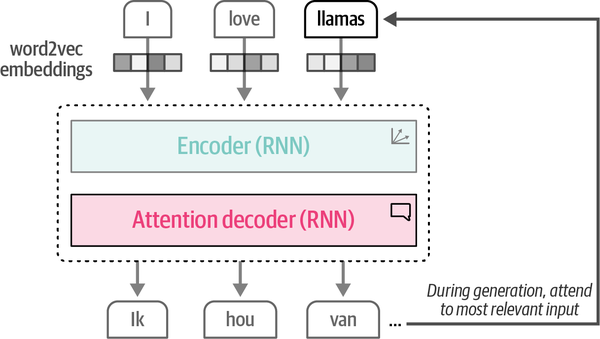

### **Brief History**

The history of Language AI encompasses many developments and models aiming to represent and generate language

&nbsp;

Some high level examples language model tasks

## **Bag of Words**

- Most common form of tokenization is splitting on a white space to create individual spaces.
- Then unique words are collected to create a vocabulary or dictionary. Using  vocabulary, we simply count how often a word in each sentence appears, quite literally creating a bag of words.

Bag-of-words considers language nothing more than a collection of words and ignores the semantic nature of text.  
 

## **Embeddings - WordVec**

Released in 2013, word2vec was one of the first successful attempts at capturing the meaning of text in *embeddings*. Embeddings are vector representations of data that attempt to capture its meaning.WordVec uses neural networks to capture relationships between words. **Using these neural networks, word2vec generates word embeddings by looking at which other words they tend to appear next to in a given sentence**.

During this training process, word2vec learns the relationship between words and distills that information into the embedding. If the two words tend to have the same neighbors, their embedding will be closer to one another and vice versa

Embeddings attempt to capture meaning by representing the properties of words. For instance, the word “baby” might score high on the properties “newborn” and “human” while the word “apple” scores low on these properties.

Embeddings can have many properties to represent the meaning of a word. Since the size of embeddings is fixed, their properties are chosen to create a mental representation of the word.

**Embeddings are tremendously helpful as they allow us to measure the semantic similarity between two words. Using various distance metrics, we can judge how close one word is to another.**

## **Types of Embedding**

There are many types of embedding, like word embeddings and sentence embeddings that are used to indicate different levels of abstractions (word versus sentence)

## Encoding and decoding context with Attention

RNNs ( recurrent neural networks) are used for two tasks encoding and decoding an input sentence. The following diagram illustrates this concept by showing how a sentence like "I love llamas" gets translated to dutch "Il hou van lama;s."

&nbsp;

Each step is **autoregressive**, i.e. when generating the next word, this architecture has needs to consume all previously generated words.

The encoding step aims to represent the input as well as possible, generating the context in the form of an embedding, which serves as the input for the decoder. To generate this representation, it takes embeddings as its inputs for words, which means we can use word2vec for the initial representations. In the following figure, we can observe this process. Note how the inputs are processed sequentially, one at a time, as well as the output.

This context embedding, however, makes it difficult to deal with longer sentences since it is merely a single embedding representing the entire input. In 2014, a solution called **attention** was introduced that highly improved upon the original architecture.[4](https://learning.oreilly.com/library/view/hands-on-large-language/9781098150952/ch01.html#ch01fn5) Attention allows a model to f**ocus on parts of the input sequence that are relevant to one another (“attend” to each other) and amplify their signal,** as shown in the following diagram.

By adding these attention mechanisms to the decoder step, the RNN can generate signals for each input word in the sequence related to the potential output. Instead of passing only a context embedding to the decoder, the hidden states of all input words are passed.

## Attention is all you need - Transformer architecture

In the well-known [“Attention is all you need” paper](https://oreil.ly/KGvIj) released in 2017. The authors proposed a network architecture called the *Transformer*, which was solely based on the attention mechanism and removed the recurrence network that we saw previously. Compared to the recurrence network, the Transformer could be trained in parallel, which tremendously sped up training.

Now, both the encoder and decoder blocks would revolve around attention instead of leveraging an RNN with attention features. The encoder block in the Transformer consists of two parts, ***self-attention* and a *feedforward neural network***, which are shown below;

**Compared to previous methods of attention, self-attention can attend to different positions within a single sequence, thereby more easily and accurately representing the input sequence, as illustrated below, instead of processing one token at a time, it can be used to look at the entire sequence in one go;**

**\\**

Compared to the encoder, the decoder has an additional layer that pays attention to the output of the encoder (to find the relevant parts of the input). As demonstrated before this process is similar to the RNN attention decoder.

the self-attention layer in the decoder masks future positions so it only attends to earlier positions to prevent leaking information when generating the output.

Together, these building blocks create the Transformer architecture and are the foundation of many impactful models in Language AI, such as BERT and GPT-1.

## Representation Models: Encoder-only models such as BERT architecture

&nbsp;

## References

1\. [Github directory for reference](https://github.com/HandsOnLLM/Hands-On-Large-Language-Models)

2\. Online repository of these notes